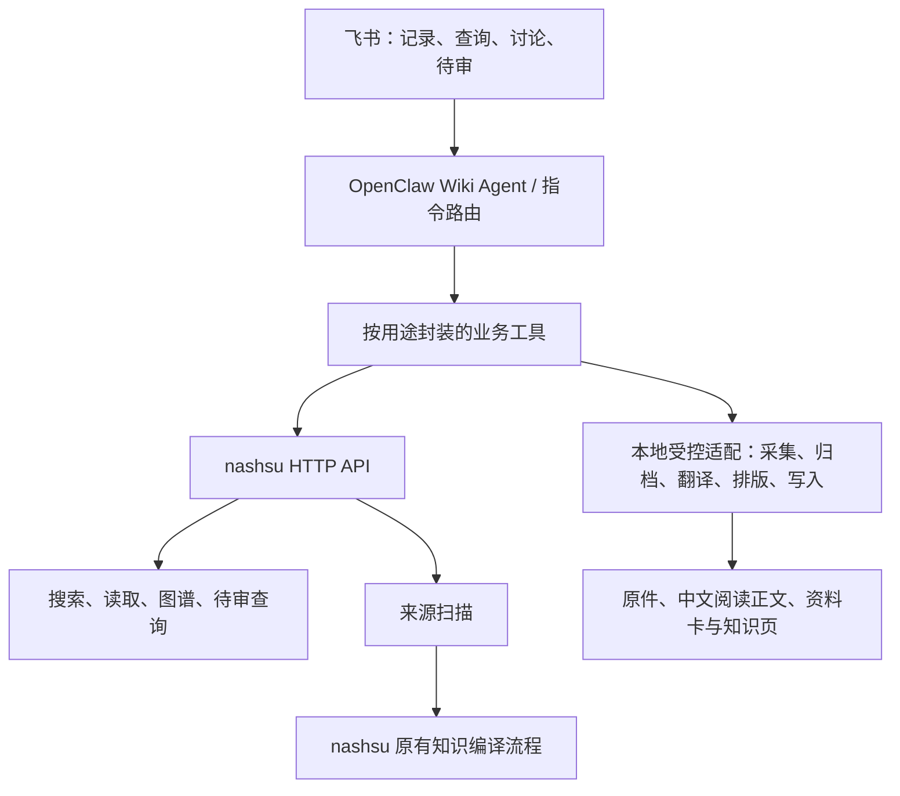

# 功能、实现版本与待决事项

更新：2026-10-01。当前本机部署 0.4.1；实现与本机验收已完成，新飞书用户入站验收由用户发起。历史 0.3.0 任务不等于各功能均已交付。

| 版本 | 范围 | 状态 |
|---|---|---|
| 0.4.0-preview.2 | 单一正式资料库、持久任务、启动恢复、受保护发布与 API 核验 | 已部署，见[报告](research/canonical-library-2026-10-01.md) |
| 0.4.1 | 公开博客、文本、多链接、个人背景、别名及显式刷新 | [计划](plans/v0.4.1.md)、[SPEC](specs/v0.4.1.md)；复用 #5/#6，远端规格 #18；[已部署验收](research/v0.4.1-acceptance-2026-10-01.md) |
| 0.4.2 | 复杂 X 串文/远端引用、登录恢复、媒体补下载交互 | 后续范围 |
| 0.5 | 飞书查询与待审动作 | 后续范围 |
| 后续 | 讨论、文件、转录、Review、GTD关联、局域网备份 | 未交付，实施前讨论具体规格 |

以下为 2026-09-27 历史能力映射与任务记录；其中“当前实现/目标版本”属于当时基线。实际可用能力以[当前用例](current-capabilities.md)及最新验收报告为准。

## 2. 调用方式

### 本轮方向：外部 Wiki Agent 调用特定用途工具，内部直连 HTTP API

用户倾向按用途封装，由 Agent 调 API；源码核查支持采用该方向。这里的 Agent 指现有 OpenClaw Wiki Agent。nashsu 内置 Agent 是另一套运行时，不要求每次都调用它的 `/chat`。

当前记录入口由插件拦截明确指令，并已注册 wiki_record、wiki_status、wiki_retry_translation；查询与讨论仍为预留入口。

- 复用 nashsu 的搜索、文件读取、图谱、来源监听、知识编译、Review 数据和语言输出规则；不另写一套知识引擎。
- MCP 也是 HTTP API 的包装。当前单一 OpenClaw 入口可直接用 API，减少一层进程接入；以后需要通用 MCP 客户端时再暴露同一套能力。
- 专用工具负责固定项目、输入校验、原件和人工内容保护、任务状态、失败恢复、回执。令牌由运行时代管，Agent 只接收业务参数和结果。
- 直连需自行保持 MCP 的固定项目能力：使用解析后的项目 ID 并核对 Vault，避免桌面切换项目后请求落到其他知识库。保留服务端路径白名单和鉴权。
- nashsu 0.6.11 没有通用 HTTP 文档转换、独立全文翻译或直接页面写入接口。相应能力通过已有桌面入口或本地受控适配接入；未核实前不承诺“全走 HTTP”。
- `/chat` 后端不使用当前 Codex CLI；查询、讨论优先由外部 Wiki Agent 取得证据后生成回答。是否改用 nashsu 后端模型以后按实际收益决定。
- HTTP Review 状态更新只标记 resolved/resolvedAction，不执行合并、建页等待审动作。应用待审须执行并验证实际动作，再更新状态，且避免与桌面并发写待审数据。

依据：[官方 MCP 文档](https://github.com/nashsu/llm_wiki/blob/v0.6.11/mcp-server/README.md)、[HTTP 客户端](https://github.com/nashsu/llm_wiki/blob/v0.6.11/mcp-server/src/api-client.ts)、[API 实现](https://github.com/nashsu/llm_wiki/blob/v0.6.11/src-tauri/src/api_server.rs)、[后端模型判断](https://github.com/nashsu/llm_wiki/blob/v0.6.11/src-tauri/src/agent/provider.rs)。

已核实的主要项目接口如下，统一前缀为 `/api/v1/projects/{id}`：

| 方法与路径 | 用途 | 调用约束 |
|---|---|---|
| `GET /files`、`GET /files/content` | 列表、文本读取 | 受白名单限制；不负责二进制转换 |
| `POST /search`、`GET /graph` | 搜索、关系检索 | 复用上游后端，当前不启用向量收费能力 |
| `GET /reviews` | 待审查询 | 保留上游 ID，映射用户可见编号 |
| `PATCH /reviews/{reviewId}`、`POST /reviews/resolve` | 单项或批量状态记录 | 只标记；批量须检查未找到的 ID；协调桌面并发 |
| `POST /sources/rescan` | 扫描来源 | 异步触发，不是完成回执 |
| `POST /chat` | 内置 Agent 会话 | 可选；需要兼容的 HTTP 模型 |

路由与 Review 限制见 [api_server.rs 路由](https://github.com/nashsu/llm_wiki/blob/v0.6.11/src-tauri/src/api_server.rs#L340)、[Mark-only 行为](https://github.com/nashsu/llm_wiki/blob/v0.6.11/src-tauri/src/api_server.rs#L1538)。另有剪藏服务 `/clip`，但它接收已提取正文，不执行网页抓取，且不提供本项目的重复 URL 幂等；当前沿用已有归档适配更合适。

### 建议的业务工具边界

以下为用途，具体工具名和参数在规格阶段固定。

| 用途 | 复用的上游能力 | 本项目补充 |
|---|---|---|
| 记录资料并查询处理进度 | 来源监听/扫描、编译、中文知识输出 | 平台抓取、归档、翻译排版、任务与回执 |
| 查询知识及来源 | search、files/content、graph | 基础解释只读检索，结果统一引用 |
| 讨论与保存结论 | 检索、读取、关联 | 外部模型讨论、区分用户判断、受控保存草稿 |
| 查看与处理待审 | reviews 读取及状态记录 | 动作执行、历史、人工保护、并发协调 |

## 3. 功能编号及实现版本

“目标版本”均为本项目版本；0.3.0 收集与中文阅读、0.4.0 查询、0.5.0 讨论的顺序已确认，后续版本为建议。已确认需求继续有效，拆版本不取消任何承诺。

| 编号 | 功能 | 当前实现版本/状态 | 建议目标版本 | nashsu 复用与缺口 |
|---|---|---|---|---|
| F01 | 单条公开 X/微信收集、图片及视频保存 | 0.2.0 已实现，指定样本通过 | 0.3.0 完成真实入口验收 | 平台采集适配；复用知识编译 |
| F02 | 原件哈希、重复链接、并发归档、变化快照 | 0.2.0 导入层有测试；飞书显式重收集入口待补 | 0.3.0 | 保留现有归档器，复用来源扫描 |
| F03 | Flash 基础解释先保存，再生成资料卡、概念、实体与关联 | 0.2.0 已实现并有公众号实测 | 0.3.0 完成整体验收 | 继续复用 nashsu 编译，基础解释是本项目补充 |
| F04 | 飞书两阶段回执、持久任务 | 0.2.0 已实现；真实入站到回执待验收，字段不全 | 0.3.0 | 补齐标题、摘要、位置、附件和待审结果 |
| F05 | 文本、多链接、个人背景、收集别名 | 0.2.0 未完整实现 | 0.3.0 | 入口适配；原规格已确认 |
| F06 | X 同作者串文及远端引用帖；本机登录与失效恢复 | 0.2.0 仅部分正文结构支持 | 0.3.0 | 平台采集适配；浏览器方案须实测 |
| F07 | 视频超限暂停、附件单独补下载 | 0.2.0 部分检查在下载后；独立补下载未完成 | 0.3.0 | 补下载前/过程中阈值控制，不改已定限制 |
| F08 | 总计五次尝试、额度等待、处理中恢复 | 0.2.0 外层部分实现，上游重试及完整恢复未统一 | 0.3.0 | 明确上下游重试预算与阶段状态，做故障验证 |
| F09 | 手写/保留段落保护、冲突观点及改写历史 | 0.2.0 规则/局部历史已有，完整程序保障待补 | 0.3.0 | 复用 Wiki 编译；增加写入保护及待审落点 |
| F10 | 待审编号、应用/跳过/稍后 | 0.2.0 可读上游建议，飞书动作未实现 | 0.3.0 | 复用 Review 读取；状态更新不能替代实际动作 |
| F11 | 完整中文译文、忠实 Markdown 排版、原文入口 | 未实现专门流程；需求已确认 | 0.3.0 | Codex CLI `gpt-5.6-terra`；翻译失败继续原文知识加工，后续单独补译 |
| F12 | 按用途封装 Agent 工具及共享 HTTP 客户端 | 0.2.0 仅有局部 rescan HTTP 调用和固定记录流程 | 0.3.0 起，随用途逐项扩展 | 优先 API；不提前造全部未来工具 |
| F13 | 飞书查询、读原文、找相关概念、来源引用 | 0.2.0 查询入口为占位 | 0.4.0 | 直接复用 search/read/graph；补 glossary 访问 |
| F14 | 多来源讨论、结论保存、综合文章草稿 | 0.2.0 讨论入口为占位 | 0.5.0 | 复用检索证据；外部 Agent 生成，综合仍待审 |
| F15 | 普通国外博客 | 未进入当前平台支持；已确认提前交付 | 0.3.0 | 复用现有抓取/转换能力，增加普通博客样本与失败验收 |
| F16 | PDF/Office/电子书/独立图片导入与正文提取 | 上游有部分解析能力，本项目未接入验收 | 0.6.0 | 优先复用桌面解析；扫描件/OCR、表格公式单独验收 |
| F17 | 音频、逐字稿、摘要 | 未实现 | 0.7.0 | 转录能力需核查；文字产物继续复用知识编译 |
| F18 | 日/周/月/季度知识 Review | 未实现周期流程；频率层级已确认 | 0.8.0 | 复用图谱、Review、知识页，具体时间和成果待定 |
| F19 | 项目关联、GTD 行动候选及反馈 | 未实现 | 0.9.0 | Wiki 提供来源；跨项目契约另行确认，不改 Apple 任务状态 |
| F20 | 原件与大附件备份、恢复；跨设备同步 | 已选未来备份至局域网另一台 Mac mini 硬盘，脚本未设置 | 后续单独安排，不阻塞 0.3.0；同步另议 | 地址、目录、周期及恢复验证到实施时再定 |

已确认版本顺序：0.3.0 完成原首版并增加普通国外博客与中文阅读；0.4.0 查询；0.5.0 讨论。后续建议：0.6.0 文件导入；0.7.0 音频；0.8.0 周期 Review；0.9.0 GTD 关联。每个版本由多个可独立验收的任务组成，不作为单个大任务实施。

人工内容保护是自动写入长期知识库的前置条件，不能以版本排序为理由推迟到后续写入后再补。Issue #1 仅在其原有验收项全部满足后才算完成。

## 4. 已确认与待决事项

### 不再重复询问

- 原件永久保留且不可覆盖；来源可追溯；重复默认复用，重新收集保留版本。
- 完整中文译文，保留英文原文入口；忠实排版，保留正文顺序和含义。
- 已定的五次尝试、视频限制、登录/额度等待、人工保护、冲突保留、综合待审。
- 现有 Vault、英文短文件名、X/微信和普通国外博客纳入 0.3.0、基础解释与文章观点分开。
- 优先复用 nashsu，本轮采用按用途封装并直连 HTTP 的技术方向。

### 第一轮已确认（Q1–Q4）

1. **版本顺序和范围**：按 0.3.0 收集＋中文阅读 → 0.4.0 查询 → 0.5.0 讨论推进，原首版缺口全部保留。
2. **英文文章首批来源**：普通国外博客和 X 均支持，博客由 0.6.0 提前到 0.3.0；原有微信及粘贴文本范围保留。PDF/Office 仍属于后续文件导入范围。
3. **新增全文翻译模型**：使用已有订阅登录的 Codex CLI，模型选 `gpt-5.6-terra`；现有 Flash 基础解释和 nashsu 知识编译模型保持现状。只对翻译步骤指定模型，质量与运行兼容性在样本验收时验证。模型不可用或额度不足时保留待处理，不自动改用付费 API。
4. **翻译失败后的行为**：保留原件，继续从原文生成资料卡及知识关联；分别记录翻译和知识编译状态，明确“中文阅读未完成”。恢复后只重试失败的翻译步骤，避免重复抓取和知识编译；原文变化另存新版本。

模型名称见 [OpenAI GPT-5.6 Terra 文档](https://developers.openai.com/api/docs/models/gpt-5.6-terra)，CLI 单次调用模型参数见 [CLI reference](https://learn.chatgpt.com/docs/developer-commands?surface=cli)。文档存在和参数支持不等于已完成本机翻译实测。

本机只读核查：`codex exec --help` 支持 `--model`；nashsu v0.6.11 的 `codex_cli_spawn` 接收单次 `model` 参数并传给 CLI。可以为独立翻译步骤指定该模型，无需更换现有知识编译模型。此调用属于 CLI/Tauri 路径，不是已有 HTTP 翻译接口。见 [参数构造](https://github.com/nashsu/llm_wiki/blob/v0.6.11/src-tauri/src/commands/codex_cli.rs#L296)。

### 第二轮已确认（Q5–Q6）

5. **旧归档补译**：既有归档不补译，新收集英文文章按完整中文流程处理。重复链接默认复用，不因译文缺失自动触发旧资料补译；原文显式重新收集且变化时按新版本处理。
6. **备份安排**：未来备份到局域网另一台 Mac mini 的硬盘，后续再设置定期备份脚本。本版不配置远端电脑、不建立备份连接或定时任务；地址、目录、频率和保留策略届时确定。

### 验收草案

沿用已确认的收集消息入口，用包含长文、图片、表格、代码和引用的合成样本验证正文完整、格式/链接保留与失败续作，再以普通公开博客和已授权 X/微信样本验证真实链路。自动检查结合人工抽样阅读，不能只以输出为中文或文件存在为通过；具体样本及判据在规格中列出供审阅。

### 随后讨论，当前不假定答案

- 0.3：使用选择已收敛；译文关联、阶段状态和样本判据在规格中固化，具体解析和浏览器实现通过工程验证确定。
- 后续备份：另一台 Mac mini 的地址/目录/连接方式、频率、附件范围、保留策略与恢复验证；独立于 0.3.0。
- 0.4：默认查询覆盖全库还是指定主题、无证据时的表现、是否允许额外联网；建议默认只用本库并明确证据缺口。术语同义词与领域消歧的展示也需确定。
- 0.5：讨论保存时点、保存粒度和用户判断标注；综合待审已确定。建议自动保存讨论草稿，明确请求后形成待审综合文章。
- 0.6：优先文件类型、扫描件/OCR、复杂图表公式和大文件失败方式。
- 0.7：说话人、时间戳、逐字稿修订。
- 0.8：Review 时间、输出和提醒方式；首版不加定时提醒的约定不变。
- 0.9：跨项目协议与稳定 ID、行动候选交接及结果反馈。

浏览器是否可复用、API 是否存在、队列如何恢复等事实由工程调查和原型验证，不让用户猜测。

## 5. 按 skills 推进

1. `grill-with-docs`（调用 `grilling`、`domain-modeling`）：本轮 Q1–Q6 已完成。后续版本按范围继续讨论；重要且难逆转的取舍才写 ADR。
2. `to-spec`：先固化下一版本已确认范围。复用 Issue #1 的既有约束，新增规格引用它；未决事项不能伪装为 ready-for-agent 的确定需求。
3. 测试边界：沿用已确认的“提交收集消息 → 观察归档、引用、任务结果和回执”；翻译在该入口增加长文不漏节、图表/代码/链接保留、失败续作和原件哈希验证。查询/讨论的外部入口及可观察结果在各自规格阶段确认。
4. `to-tickets`：每项任务贯通入口、处理和结果，可独立演示；先展示拆分、阻塞关系和验收条件，再按 skill 发布到 GitHub Issues。不同版本不人为串行，依赖按实际功能确定。
5. `implement`＋`tdd`：按已确认测试边界逐条红灯→绿灯；重构在 review 阶段进行，原件保护、幂等、失败恢复与引用优先。
6. `code-review`：基于实施前固定 Git 基点，分别检查规范和规格；完成适当测试和真实验收后再记录实际交付版本。

0.3.0 规格与 11 项任务均已发布，复用方式已逐项说明；本轮未修改运行配置或升级底座，开发和验收结果随后记录。
